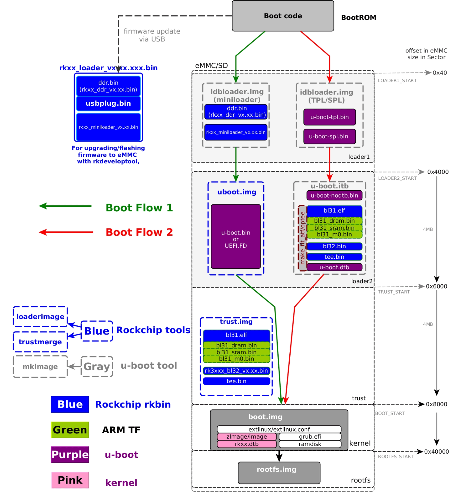
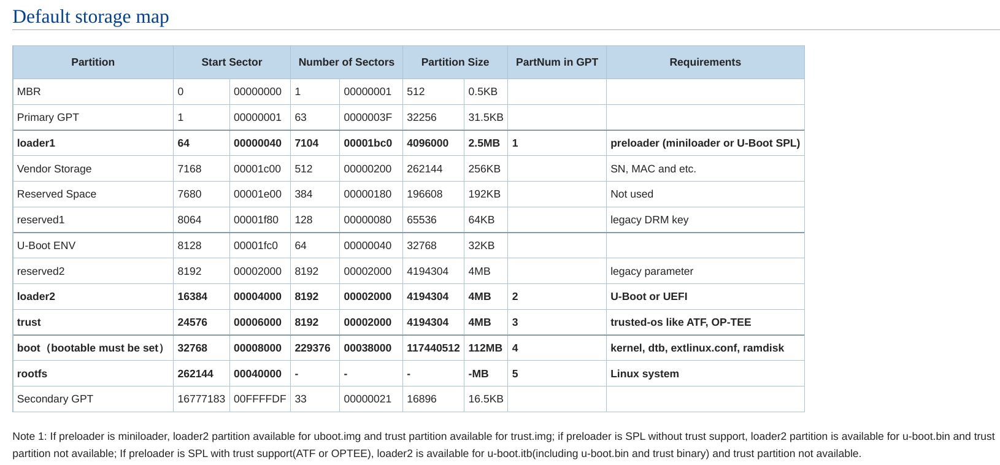
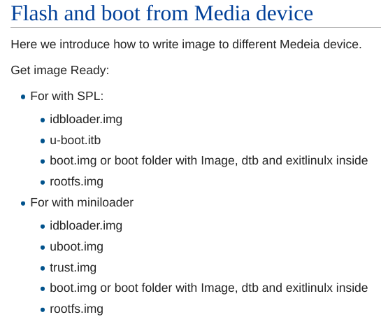

# HD9901 Rk3399 Board移植笔记

## Part2: 移植前准备--固件尝试

#### 一、硬件参数
HD9901实为中移互联生产的M1，M1L，M3门禁机，是中国移动前期推广智慧小区的OEM配套产物，相关资料少之又少，有V2.4、2.6、3.0等多个主板版本号，但硬件参数和接口布局基本一致，硬件参数如下：
| 硬件 | 型号 | 备注 |
| :----:| :----: | :----: |
| Soc | RockChip Rk3399|  2\*A72 + 4\*A53 + Mali T860 |
| 内存 | K4B4G16 | 2G DDR3 4*512M 1866Mbps 1.5V|
| EMMC | KLMAG1JETD-B041 | 16G HS400 1.8/3.3V |
| 有线网卡 | RTL8211E | Gigabit Ethernet |
| 无线网卡 | AP6255 | 2.4/5Ghz + Bluetooth 4.2 |
| PMIC | RK808 |  |
| USB | 1 * USB-A 3.0 + 1 * USB-C |
| HDMI | Mini HDMI 19 pins |

选择配置相近的设备为基础可以减少适配工作量，至少保证:
①设备能够正常启动
②有线网卡或者串口能够正常工作

TN3399：
| 硬件 | 型号 |
| :----:| :----: |
| 有线网卡 | RTL8211E |
| 无线网卡 | AP6255 |
| USB | 2 * USB-A 3.0 |

NanoPC T4:
| 硬件 | 型号 |
| :----:| :----: |
| 有线网卡 | RTL8211E-VB-CG |
| 无线网卡 | AP6356S |
| USB | 1 * USB-A 3.0 + 1 * USB-C |

#### 二、固件测试
1、TN3399和HD9901的配置非常相似，本以为其固件能够直接启动，但实测下来，无视任何条件，直接刷入能够启动的仅有lanseyujie大佬适配的[ubuntu-server](https://github.com/lanseyujie/tn3399_v3/releases/tag/v1.0.0-beta)能够启动，有线网卡工作正常，但USB失效，且机器有异响。
查看分区结构：
```
$ fdisk -l -u system.img 
Disk system.img: 1.88 GiB, 2013265920 bytes, 3932160 sectors
Units: sectors of 1 * 512 = 512 bytes
Sector size (logical/physical): 512 bytes / 512 bytes
I/O size (minimum/optimal): 512 bytes / 512 bytes
Disklabel type: gpt
Disk identifier: 5F4C43B7-140D-442A-8B60-23577065BF6A

Device       Start     End Sectors  Size Type
system.img1     64    8063    8000  3.9M Linux filesystem
system.img2  16384   24575    8192    4M Linux filesystem
system.img3  24576   32767    8192    4M Linux filesystem
system.img4  32768  262143  229376  112M EFI System
system.img5 262144 3932126 3669983  1.7G Linux filesystem
```
使用`gdisk`查看：
```
$ gdisk system.img 
GPT fdisk (gdisk) version 1.0.9

Partition table scan:
  MBR: protective
  BSD: not present
  APM: not present
  GPT: present

Found valid GPT with protective MBR; using GPT.

Command (? for help): p
Disk system.img: 3932160 sectors, 1.9 GiB
Sector size (logical): 512 bytes
Disk identifier (GUID): 5F4C43B7-140D-442A-8B60-23577065BF6A
Partition table holds up to 128 entries
Main partition table begins at sector 2 and ends at sector 33
First usable sector is 34, last usable sector is 3932126
Partitions will be aligned on 64-sector boundaries
Total free space is 8350 sectors (4.1 MiB)

Number  Start (sector)    End (sector)  Size       Code  Name
   1              64            8063   3.9 MiB     8300  loader1
   2           16384           24575   4.0 MiB     8300  loader2
   3           24576           32767   4.0 MiB     8300  trust
   4           32768          262143   112.0 MiB   EF00  boot
   5          262144         3932126   1.7 GiB     8300  rootfs
```
可见磁盘镜像是GPT分区格式，遵循Rockchip平台 `idbloader + uboot + trust + rootfs`的结构

<center>
    
    <figcaption>图1</figcaption>
</center>

2.RK3399还有很多固件并非上面的格式：
①NanoPC T4的Armbian镜像：
```
$ fdisk -lu Armbian_community_25.2.0-trunk.110_Nanopct4_noble_current_6.6.63_gnome-kisak_desktop.img
Disk Armbian_community_25.2.0-trunk.110_Nanopct4_noble_current_6.6.63_gnome-kisak_desktop.img: 6.39 GiB, 6861881344 bytes, 13402112 sectors
Units: sectors of 1 * 512 = 512 bytes
Sector size (logical/physical): 512 bytes / 512 bytes
I/O size (minimum/optimal): 512 bytes / 512 bytes
Disklabel type: dos
Disk identifier: 0x434a1781

Device                                                                                    Boot Start      End  Sectors  Size Id Type
Armbian_community_25.2.0-trunk.110_Nanopct4_noble_current_6.6.63_gnome-kisak_desktop.img1      32768 13402111 13369344  6.4G 83 Linux
```
②TN3399的Armbian 24.2.1的镜像：
```
$ fdisk -lu Armbian_24.2.1_TN3399-V3_jammy_current_6.6.16.img
Disk Armbian_24.2.1_TN3399-V3_jammy_current_6.6.16.img: 2.81 GiB, 3015704576 bytes, 5890048 sectors
Units: sectors of 1 * 512 = 512 bytes
Sector size (logical/physical): 512 bytes / 512 bytes
I/O size (minimum/optimal): 512 bytes / 512 bytes
Disklabel type: dos
Disk identifier: 0x4699421e

Device                                             Boot Start     End Sectors  Size Id Type
Armbian_24.2.1_TN3399-V3_jammy_current_6.6.16.img1      32768 5890047 5857280  2.8G 83 Linux
```
③TN3399的Armbian 25.02.0镜像：
```
$ fdisk -lu Armbian_25.02.0_rockchip_tn3399_noble_6.1.120_server_2024.12.15.img
Disk Armbian_25.02.0_rockchip_tn3399_noble_6.1.120_server_2024.12.15.img: 3.02 GiB, 3238002688 bytes, 6324224 sectors
Units: sectors of 1 * 512 = 512 bytes
Sector size (logical/physical): 512 bytes / 512 bytes
I/O size (minimum/optimal): 512 bytes / 512 bytes
Disklabel type: gpt
Disk identifier: 5EA037BB-42C3-471B-AA2E-7D1ACD10785F

Device                                                                 Start     End Sectors  Size Type
Armbian_25.02.0_rockchip_tn3399_noble_6.1.120_server_2024.12.15.img1   32768 1079295 1046528  511M Linux filesystem
Armbian_25.02.0_rockchip_tn3399_noble_6.1.120_server_2024.12.15.img2 1081344 6322175 5240832  2.5G Linux filesystem
```
④Rocknix的镜像：
```
$ fdisk -lu ROCKNIX-RK3399.aarch64-20240708.img 
Disk ROCKNIX-RK3399.aarch64-20240708.img: 2.05 GiB, 2198863872 bytes, 4294656 sectors
Units: sectors of 1 * 512 = 512 bytes
Sector size (logical/physical): 512 bytes / 512 bytes
I/O size (minimum/optimal): 512 bytes / 512 bytes
Disklabel type: gpt
Disk identifier: 28BDAA58-6BC3-4C9D-918C-424AC74170BD

Device                                 Start     End Sectors Size Type
ROCKNIX-RK3399.aarch64-20240708.img1   32768 4227071 4194304   2G Microsoft basic data
ROCKNIX-RK3399.aarch64-20240708.img2 4227072 4292607   65536  32M Linux filesystem
```
`gdisk`查看：
```
$ gdisk ROCKNIX-RK3399.aarch64-20240708.img 
GPT fdisk (gdisk) version 1.0.9

Partition table scan:
  MBR: protective
  BSD: not present
  APM: not present
  GPT: present

Found valid GPT with protective MBR; using GPT.

Command (? for help): p
Disk ROCKNIX-RK3399.aarch64-20240708.img: 4294656 sectors, 2.0 GiB
Sector size (logical): 512 bytes
Disk identifier (GUID): 28BDAA58-6BC3-4C9D-918C-424AC74170BD
Partition table holds up to 128 entries
Main partition table begins at sector 2 and ends at sector 33
First usable sector is 34, last usable sector is 4294622
Partitions will be aligned on 2048-sector boundaries
Total free space is 34749 sectors (17.0 MiB)

Number  Start (sector)    End (sector)  Size       Code  Name
   1           32768         4227071   2.0 GiB     0700  system
   2         4227072         4292607   32.0 MiB    8300  storage
```
⑥AM40 Armbian_25.02.0的镜像
```
$ fdisk -lu Armbian_25.02.0_rockchip_smart-am40_noble_6.1.120_server_2024.12.15.img 
Disk Armbian_25.02.0_rockchip_smart-am40_noble_6.1.120_server_2024.12.15.img: 3.02 GiB, 3238002688 bytes, 6324224 sectors
Units: sectors of 1 * 512 = 512 bytes
Sector size (logical/physical): 512 bytes / 512 bytes
I/O size (minimum/optimal): 512 bytes / 512 bytes
Disklabel type: gpt
Disk identifier: E2283CCD-C651-48FE-9E84-72FF60B1FED8

Device                                                                     Start     End Sectors  Size Type
Armbian_25.02.0_rockchip_smart-am40_noble_6.1.120_server_2024.12.15.img1   32768 1079295 1046528  511M Linux filesystem
Armbian_25.02.0_rockchip_smart-am40_noble_6.1.120_server_2024.12.15.img2 1081344 6322175 5240832  2.5G Linux filesystem
```
`gdisk`查看：
```
$ gdisk Armbian_25.02.0_rockchip_smart-am40_noble_6.1.120_server_2024.12.15.img 
GPT fdisk (gdisk) version 1.0.9

Partition table scan:
  MBR: protective
  BSD: not present
  APM: not present
  GPT: present

Found valid GPT with protective MBR; using GPT.

Command (? for help): p
Disk Armbian_25.02.0_rockchip_smart-am40_noble_6.1.120_server_2024.12.15.img: 6324224 sectors, 3.0 GiB
Sector size (logical): 512 bytes
Disk identifier (GUID): E2283CCD-C651-48FE-9E84-72FF60B1FED8
Partition table holds up to 128 entries
Main partition table begins at sector 2 and ends at sector 33
First usable sector is 34, last usable sector is 6324190
Partitions will be aligned on 2048-sector boundaries
Total free space is 36797 sectors (18.0 MiB)

Number  Start (sector)    End (sector)  Size       Code  Name
   1           32768         1079295   511.0 MiB   8300  primary
   2         1081344         6322175   2.5 GiB     8300  primary
```
可见上面的镜像无论是多分区还是单分区、GPT格式还是MBR格式，`fdisk`命令识别出的参数中，`Start`都是从`32768`扇区开始。对照TN3399的Ubuntu固件可以看出，`trust`分区在`32767`扇区处结束，`boot`分区由从`32768`扇区开始。

看到这个分区结构其实比较疑惑，`rootfs`分区占据了`boot`分区的位置。

①对HD9901可启动的TN3399 Ubuntu镜像进行挂载：
`boot`分区：
`$ sudo mount -o loop,offset=16777216 system.img ./mount`
__注：__`Start`值可用于计算`offset`，计算公式为：
```offset=Start*Num （Num为一个扇区大小）```，自动挂载`offset`起始的1个分区。
`boot`分区内的内容为：
```
$ tree mount/
mount/
├── extlinux
│   └── extlinux.conf
├── Image
└── tn3399-linux.dtb
```
可见其结构符合**图1**

卸载后再次挂载`rootfs`分区：
`$ sudo mount -o loop,offset=134217728 system.img ./mount`
发现`rootfs`分区内的`boot`文件夹为空。

②对TN3399的Armbian镜像进行挂载：
`$ sudo mount -o loop,offset=16777216 Armbian_24.2.1_TN3399-V3_jammy_current_6.6.16.img ./mount`

发现`rootfs`分区内的`boot`文件夹并非为空：
```
$ tree mount/boot/
mount/boot/
├── armbianEnv.txt
├── armbian_first_run.txt.template
├── boot.bmp
├── boot.cmd
├── boot.scr
├── config-6.6.16-current-rockchip64
├── dtb -> dtb-6.6.16-current-rockchip64
├── dtb-6.6.16-current-rockchip64
│   └── rockchip
│       ├── overlay
│       │   ├── README.rockchip-overlays
│       │   ├── rk3308-bs@1.3ghz.dtbo
│       │   ├── rk3308-bs.dtbo
│       │   ├── rk3308-emmc.dtbo
│       │   ├── rk3308-s0-ext-antenna.dtbo
│       │   ├── rk3308-sdio@10mhz.dtbo
│       │   ├── rk3308-sdio@4mhz.dtbo
│       │   ├── rockchip-fixup.scr
│       │   ├── rockchip-rk3318-box-cpu-hs.dtbo
│       │   ├── rockchip-rk3318-box-emmc-ddr.dtbo
│       │   ├── rockchip-rk3318-box-emmc-hs200.dtbo
│       │   ├── rockchip-rk3318-box-led-conf1.dtbo
│       │   ├── rockchip-rk3318-box-led-conf2.dtbo
│       │   ├── rockchip-rk3318-box-led-conf3.dtbo
│       │   ├── rockchip-rk3318-box-led-conf4.dtbo
│       │   ├── rockchip-rk3318-box-wlan-ap6330.dtbo
│       │   ├── rockchip-rk3318-box-wlan-ap6334.dtbo
│       │   ├── rockchip-rk3318-box-wlan-ext.dtbo
│       │   ├── rockchip-rk3328-i2c0.dtbo
│       │   ├── rockchip-rk3328-i2s1-pcm5102.dtbo
│       │   ├── rockchip-rk3328-opp-1.4ghz.dtbo
│       │   ├── rockchip-rk3328-opp-1.5ghz.dtbo
│       │   ├── rockchip-rk3328-uart1.dtbo
│       │   ├── rockchip-rk3399-dwc3-0-host.dtbo
│       │   ├── rockchip-rk3399-i2c7.dtbo
│       │   ├── rockchip-rk3399-i2c8.dtbo
│       │   ├── rockchip-rk3399-opp-2ghz.dtbo
│       │   ├── rockchip-rk3399-pcie-gen2.dtbo
│       │   ├── rockchip-rk3399-spi-jedec-nor.dtbo
│       │   ├── rockchip-rk3399-spi-spidev.dtbo
│       │   ├── rockchip-rk3399-uart4.dtbo
│       │   ├── rockchip-rk3399-uhs.dtbo
│       │   ├── rockchip-rk3399-w1-gpio.dtbo
│       │   ├── rockchip-rk3566-sata2.dtbo
│       │   ├── rockchip-rk3568-hk-i2c0.dtbo
│       │   ├── rockchip-rk3568-hk-i2c1.dtbo
│       │   ├── rockchip-rk3568-hk-pwm1.dtbo
│       │   ├── rockchip-rk3568-hk-pwm2.dtbo
│       │   ├── rockchip-rk3568-hk-pwm9.dtbo
│       │   ├── rockchip-rk3568-hk-spi-spidev.dtbo
│       │   ├── rockchip-rk3568-hk-uart0.dtbo
│       │   ├── rockchip-rk3568-hk-uart0-rts_cts.dtbo
│       │   ├── rockchip-rk3568-hk-uart1.dtbo
│       │   ├── rockchip-rk3568-nanopi-r5c-leds.dtbo
│       │   ├── rockchip-rk3568-nanopi-r5s-leds.dtbo
│       │   ├── rockchip-rockpi4cplus-usb-host.dtbo
│       │   └── rockchip-rockpro64-lcd.dtbo
│       ├── px30-engicam-px30-core-ctouch2.dtb
│       ├── px30-engicam-px30-core-ctouch2-of10.dtb
│       ├── px30-engicam-px30-core-edimm2.2.dtb
│       ├── px30-evb.dtb
│       ├── px30-ringneck-haikou.dtb
│       ├── rk3308-evb.dtb
│       ├── rk3308-roc-cc.dtb
│       ├── rk3308-rock-pi-s.dtb
│       ├── rk3308-rock-s0.dtb
│       ├── rk3318-a95x-z2.dtb
│       ├── rk3318-box.dtb
│       ├── rk3326-anbernic-rg351m.dtb
│       ├── rk3326-odroid-go2.dtb
│       ├── rk3326-odroid-go2-v11.dtb
│       ├── rk3326-odroid-go3.dtb
│       ├── rk3328-a1.dtb
│       ├── rk3328-evb.dtb
│       ├── rk3328-nanopi-neo3-rev02.dtb
│       ├── rk3328-nanopi-r2c.dtb
│       ├── rk3328-nanopi-r2c-plus.dtb
│       ├── rk3328-nanopi-r2-rev00.dtb
│       ├── rk3328-nanopi-r2-rev06.dtb
│       ├── rk3328-nanopi-r2-rev20.dtb
│       ├── rk3328-nanopi-r2s.dtb
│       ├── rk3328-orangepi-r1-plus.dtb
│       ├── rk3328-orangepi-r1-plus-lts.dtb
│       ├── rk3328-roc-cc.dtb
│       ├── rk3328-rock64.dtb
│       ├── rk3328-rock-pi-e.dtb
│       ├── rk3328-roc-pc.dtb
│       ├── rk3328-z28pro.dtb
│       ├── rk3368-evb-act8846.dtb
│       ├── rk3368-geekbox.dtb
│       ├── rk3368-lion-haikou.dtb
│       ├── rk3368-orion-r68-meta.dtb
│       ├── rk3368-px5-evb.dtb
│       ├── rk3368-r88.dtb
│       ├── rk3399-eaidk-610.dtb
│       ├── rk3399-evb.dtb
│       ├── rk3399-ficus.dtb
│       ├── rk3399-firefly.dtb
│       ├── rk3399-gru-bob.dtb
│       ├── rk3399-gru-kevin.dtb
│       ├── rk3399-gru-scarlet-dumo.dtb
│       ├── rk3399-gru-scarlet-inx.dtb
│       ├── rk3399-gru-scarlet-kd.dtb
│       ├── rk3399-hugsun-x99.dtb
│       ├── rk3399-khadas-edge-captain.dtb
│       ├── rk3399-khadas-edge.dtb
│       ├── rk3399-khadas-edge-v.dtb
│       ├── rk3399-kobol-helios64.dtb
│       ├── rk3399-leez-p710.dtb
│       ├── rk3399-nanopc-t4.dtb
│       ├── rk3399-nanopi-m4b.dtb
│       ├── rk3399-nanopi-m4.dtb
│       ├── rk3399-nanopi-m4v2.dtb
│       ├── rk3399-nanopi-neo4.dtb
│       ├── rk3399-nanopi-r4s.dtb
│       ├── rk3399-nanopi-r4se.dtb
│       ├── rk3399-nanopi-r4s-enterprise.dtb
│       ├── rk3399-orangepi-4.dtb
│       ├── rk3399-orangepi-4-lts.dtb
│       ├── rk3399-orangepi.dtb
│       ├── rk3399-pinebook-pro.dtb
│       ├── rk3399-pinephone-pro.dtb
│       ├── rk3399pro-rock-pi-n10.dtb
│       ├── rk3399pro-tinker-edge-r.dtb
│       ├── rk3399-puma-haikou.dtb
│       ├── rk3399-rock-4c-plus.dtb
│       ├── rk3399-rock-4se.dtb
│       ├── rk3399-rock960.dtb
│       ├── rk3399-rock-pi-4a.dtb
│       ├── rk3399-rock-pi-4a-plus.dtb
│       ├── rk3399-rock-pi-4b.dtb
│       ├── rk3399-rock-pi-4b-plus.dtb
│       ├── rk3399-rock-pi-4c.dtb
│       ├── rk3399-rock-pi-4.dtb
│       ├── rk3399-rockpro64.dtb
│       ├── rk3399-rockpro64-v2.dtb
│       ├── rk3399-roc-pc.dtb
│       ├── rk3399-roc-pc-mezzanine.dtb
│       ├── rk3399-roc-pc-plus.dtb
│       ├── rk3399-sapphire.dtb
│       ├── rk3399-sapphire-excavator.dtb
│       ├── rk3399-tinker-2.dtb
│       ├── rk3566-anbernic-rg353p.dtb
│       ├── rk3566-anbernic-rg353ps.dtb
│       ├── rk3566-anbernic-rg353v.dtb
│       ├── rk3566-anbernic-rg353vs.dtb
│       ├── rk3566-anbernic-rg503.dtb
│       ├── rk3566-box-demo.dtb
│       ├── rk3566-jp-tvbox.dtb
│       ├── rk3566-lubancat-1.dtb
│       ├── rk3566-orangepi-3b.dtb
│       ├── rk3566-orangepi-3b-sata.dtb
│       ├── rk3566-panther-x2.dtb
│       ├── rk3566-pinenote-v1.1.dtb
│       ├── rk3566-pinenote-v1.2.dtb
│       ├── rk3566-quartz64-a.dtb
│       ├── rk3566-quartz64-b.dtb
│       ├── rk3566-radxa-cm3-io.dtb
│       ├── rk3566-rock-3c.dtb
│       ├── rk3566-roc-pc.dtb
│       ├── rk3566-soquartz-blade.dtb
│       ├── rk3566-soquartz-cm4.dtb
│       ├── rk3566-soquartz-model-a.dtb
│       ├── rk3568-bpi-r2-pro.dtb
│       ├── rk3568-evb1-v10.dtb
│       ├── rk3568-fastrhino-r66s.dtb
│       ├── rk3568-fastrhino-r68s.dtb
│       ├── rk3568-hinlink-h66k.dtb
│       ├── rk3568-hinlink-h68k.dtb
│       ├── rk3568-lubancat-2.dtb
│       ├── rk3568-nanopi-r5c.dtb
│       ├── rk3568-nanopi-r5s.dtb
│       ├── rk3568-odroid-m1.dtb
│       ├── rk3568-radxa-e25.dtb
│       ├── rk3568-rock-3a.dtb
│       ├── rk3568-roc-pc.dtb
│       ├── rk3588-edgeble-neu6a-io.dtb
│       ├── rk3588-edgeble-neu6b-io.dtb
│       ├── rk3588-evb1-v10.dtb
│       ├── rk3588-nanopc-t6.dtb
│       ├── rk3588-rock-5b.dtb
│       ├── rk3588s-indiedroid-nova.dtb
│       ├── rk3588s-khadas-edge2.dtb
│       └── rk3588s-rock-5a.dtb
├── Image -> vmlinuz-6.6.16-current-rockchip64
├── initrd.img -> initrd.img-6.6.16-current-rockchip64
├── initrd.img-6.6.16-current-rockchip64
├── initrd.img.old -> initrd.img-6.6.16-current-rockchip64
├── rk3399-tn3399-v3.dtb
├── rk3399-tn3399-v3-with-1024x600-single-8bit-lvds-panel.dtb
├── System.map-6.6.16-current-rockchip64
├── uInitrd -> uInitrd-6.6.16-current-rockchip64
├── uInitrd-6.6.16-current-rockchip64
├── vmlinuz -> vmlinuz-6.6.16-current-rockchip64
├── vmlinuz-6.6.16-current-rockchip64
└── vmlinuz.old -> vmlinuz-6.6.16-current-rockchip64
```
③从上面两个固件解包的情况来看，存在2种情况：
（1）独立`boot`分区+空`rootfs/boot`
（2）无`boot`分区+非空`rootfs/boot`

查阅了Rockchip的wiki才明白了两种格式固件的存在原理：
根据[Partitions](https://opensource.rock-chips.com/wiki_Partitions)中描述，`32768`扇区后必须要接可启动分区,但根据测试结果来看，`AM40 Armbian_25.02.0`镜像能够启动，分区表为`GPT`，但`32768`扇区后并非为可启动分区。
<center>
    
    <figcaption>图2</figcaption>
</center>

又根据[Boot_option](https://opensource.rock-chips.com/wiki_Boot_option)中描述，`boot`分区可以单独存在，但其包含的`kernel`,`dtb`,`extlinux.conf`等也可以储存在`32768`扇区开始的分区根目录下的`boot`文件夹中。
<center>
    
    <figcaption>图3</figcaption>
</center>

④猜想：从`32768`扇区起始的镜像写入时**并不会清空**EMMC中此扇区之前的数据，但需要保证刷入第三方系统镜像时，原EMMC中包含完整的可引导第三方系统的`idbloader`、`uboot`、`trust`分区，否则无法启动。
验证：
（1）刷入tn3399 Ubuntu固件后读取分区表：
```
$ ./rkdeveloptool ppt
**********Partition Info(GPT)**********
NO  LBA       Name                
00  00000040  loader1
01  00004000  loader2
02  00006000  trust
03  00008000  boot
04  00040000  rootfs
```
（2）写入AM40 Armbian_25.02.0镜像并读取新的分区表：
```
$ ./rkdeveloptool wl 0x00 '/home/sjll/Downloads/Armbian_25.02.0_rockchip_smart-am40_noble_6.1.120_server_2024.12.15.img'
Write LBA from file (100%)
$ ./rkdeveloptool ppt
**********Partition Info(GPT)**********
NO  LBA       Name                
00  00008000  primary
01  00108000  primary
```
可见逻辑区块地址`0X8000`之前的分区内容已无法被`rkdeveloptool`读出，此时通电后系统可以正常启动。
从系统当中使用`fdisk`查看分区情况：
```
root@armbian:~# fdisk -lu
Disk /dev/mmcblk0: 14.56 GiB, 15634268160 bytes, 30535680 sectors
Units: sectors of 1 * 512 = 512 bytes
Sector size (logical/physical): 512 bytes / 512 bytes
I/O size (minimum/optimal): 512 bytes / 512 bytes
Disklabel type: gpt
Disk identifier: E2283CCD-C651-48FE-9E84-72FF60B1FED8

Device           Start      End  Sectors  Size Type
/dev/mmcblk0p1   32768  1079295  1046528  511M Linux filesystem
/dev/mmcblk0p2 1081344 30535646 29454303   14G Linux filesystem


Disk /dev/mmcblk0boot0: 4 MiB, 4194304 bytes, 8192 sectors
Units: sectors of 1 * 512 = 512 bytes
Sector size (logical/physical): 512 bytes / 512 bytes
I/O size (minimum/optimal): 512 bytes / 512 bytes


Disk /dev/mmcblk0boot1: 4 MiB, 4194304 bytes, 8192 sectors
Units: sectors of 1 * 512 = 512 bytes
Sector size (logical/physical): 512 bytes / 512 bytes
I/O size (minimum/optimal): 512 bytes / 512 bytes
```
提取`mmcblk0boot0`和`mmcblk0boot1`两个块设备：
```
root@armbian:~# dd if=/dev/mmcblk0boot0 of=/tmp/boot0.img
8192+0 records in
8192+0 records out
4194304 bytes (4.2 MB, 4.0 MiB) copied, 0.0544181 s, 77.1 MB/s
root@armbian:~# dd if=/dev/mmcblk0boot1 of=/tmp/boot1.img
8192+0 records in
8192+0 records out
4194304 bytes (4.2 MB, 4.0 MiB) copied, 0.0535267 s, 78.4 MB/s
```
传输到本地：
```
$ scp root@192.168.123.181:/tmp/boot0.img .
root@192.168.123.181's password: 
boot0.img                                                                                100% 4096KB  20.1MB/s   00:00    
$ scp root@192.168.123.181:/tmp/boot1.img .
root@192.168.123.181's password: 
boot1.img                                                                                100% 4096KB  11.7MB/s   00:00
```
使用`Ghex`查看后，发现其内容全为`0`。
使用`rkdeveloptool`读取EMMC中内容：
`./rkdeveloptool rl 0x4000 0x2000 uboot.img`
使用`Ghex`查看后，发现`uboot`仍存在于EMMC中，并未被清空。

#### <font color=Red>以下为仅供参考的多余步骤</font>
制作包含新`rootfs`分区的固件：
提取rootfs镜像，以Armbian为例：
```
$ fdisk -lu Armbian_24.2.1_TN3399-V3_jammy_current_6.6.16.img
Disk Armbian_24.2.1_TN3399-V3_jammy_current_6.6.16.img: 2.81 GiB, 3015704576 bytes, 5890048 sectors
Units: sectors of 1 * 512 = 512 bytes
Sector size (logical/physical): 512 bytes / 512 bytes
I/O size (minimum/optimal): 512 bytes / 512 bytes
Disklabel type: dos
Disk identifier: 0x4699421e

Device                                             Boot Start     End Sectors  Size Id Type
Armbian_24.2.1_TN3399-V3_jammy_current_6.6.16.img1      32768 5890047 5857280  2.8G 83 Linux
```
使用dd命令：
```
$ dd bs=512 skip=32768 count=5857280 if=Armbian_24.2.1_TN3399-V3_jammy_current_6.6.16.img of=rootfs.img
输入了 5857280+0 块记录
输出了 5857280+0 块记录
2998927360 字节 (3.0 GB, 2.8 GiB) 已复制，39.3691 s，76.2 MB/s
```
__注：__`skip`值为扇区起始值，`count`为`fdisk`结果中`Sectors`值。

创建大小为3GB的空镜像文件：
`dd if=/dev/zero of=firmware.img bs=1M count=0 seek=3072`
**注**：比所有镜像文件和保留分区容量之和大即可，小于EMMC容量

更改空白镜像的分区格式为`GPT`:
`parted -s firmware.img mklabel gpt`

按照Rockchip的规范创建分区：
```
parted -s firmware.img unit s mkpart loader1 64 8063
parted -s firmware.img unit s mkpart loader2 16384 24575
parted -s firmware.img unit s mkpart trust 24576 32767
parted -s firmware.img -- unit s mkpart rootfs 32768 -2049s
```
设置`boot`或者`rootfs/boot`所在分区为`bootable`(此处为第四个分区):
`parted -s firmware.img set 4 boot on`

设置`rootfs`分区的`UUID`:
```
gdisk firmware.img <<EOF
x
c
4
B921B045-1DF0-41C3-AF44-4C6F280D3FAE
w
y
EOF
```
写入`idbloader`、`uboot`、`trust`、`rootfs`分区镜像：
```
dd if=idbloader.img of=firmware.img seek=64 conv=notrunc
dd if=uboot.img of=firmware.img seek=16384 conv=notrunc
dd if=trust.img of=firmware.img seek=24576 conv=notrunc
dd if=rootfs.img of=firmware.img seek=32768 conv=notrunc,fsync
```